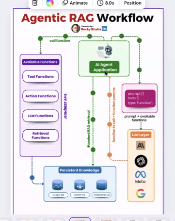
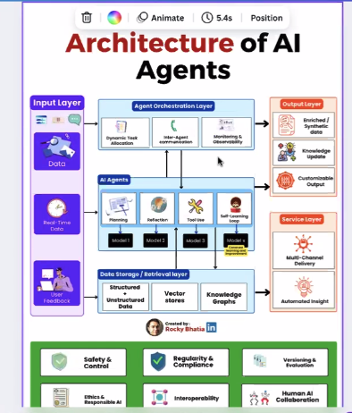
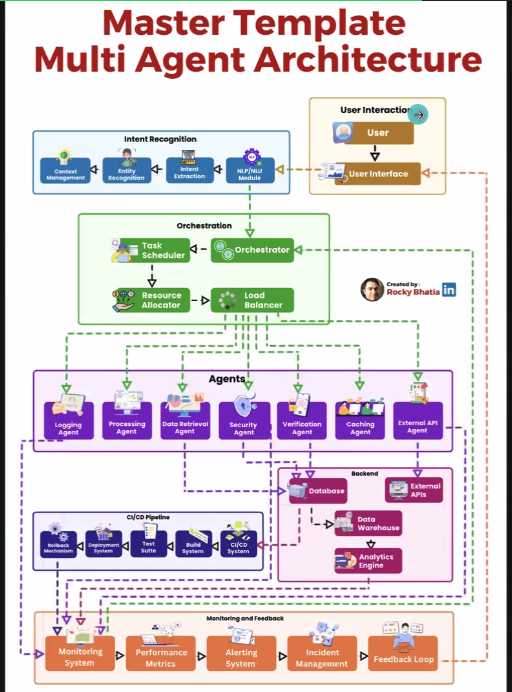

# Agenda for Today's Session:

## AI Roadmap:

1.  **Python Fundamentals**
2.  **Machine Learning Basics**
    *   Types of Machine Learning
    *   Neural Networks
    *   Feature Engineering
3.  **Introduction to LLMs**
    *   Transformers
    *   Fine-Tuning
    *   Context Window
4.  **Prompt Engineering Essentials**
    *   Chain of Thought
    *   Graph of Thought
    *   Few-shot, Zero-shot Learning
    *   Role-based Prompts
5.  **API Fundamentals**
    *   API Types
    *   GPT Wrappers
    *   File I/O
    *   Authentication
6.  **Frameworks**
    *   LLM Wrappers
    *   Retrievers
    *   Document Loaders
    *   Chunking
    *   Memory
    *   LangChain
7.  **RAG (Retrieval-Augmented Generation)**
    *   Embeddings
    *   Vector Stores
    *   Retrieval Models
    *   Generation Models
8.  **AI Agent Frameworks**
    *   Types of Agents
    *   Tools and MCP (Master Control Program)
    *   Agent Memory
9.  **Multi-Agent Systems**
    *   Types of MAS
    *   Communication
    *   Agents
    *   Hand-Offs
    *   A2A Protocol
10. **Evaluation and Observability**
    *   Metrics
    *   Logging
    *   Latency
    *   Stress Testing

---

## Why Do We Need Agents?

*   To fetch real-time data such as weather, sports scores, flight tickets, and more.
*   To combine LLMs with agents for actionable intelligence.
*   Agents are essential when actions need to be performed, such as creating a VM, resetting a password, or granting access to resources.

**Example:**

*   Building an agentic application for IT support.
*   For example, onboarding a new user: the chatbot interprets the request and takes necessary actions using Agentic AI.

---

## Essential Components for Agentic Applications:

1.  UI/Chatbot
2.  LLM (Large Language Model)
3.  RAG (Retrieval-Augmented Generation)
4.  Vector Database
5.  LangChain
6.  Tools (APIs, Functions)
7.  Memory
    *   Memory type varies by use case (short-term, long-term)
    *   Typically stored in in-memory databases
8.  Reasoning

---
## Architecture of AI Agents

## How Does the LLM Find Relevant Information?

*   The LLM analyzes the user query and invokes the most relevant agent to handle the request.

---

## How to Initialize an Agent?

*   Initialize the agent with appropriate tools tailored to the specific use case.

---

## General AI Agentic Architecture:

User → UI/Chatbot Application → Intent Classification (multiple agents possible) → Knowledge Agent, Code Agent, Test Case Agent

*   Each agent can be registered with multiple tools depending on its use case.

**Step 1:** The user's question is classified, and the query is routed to the appropriate agent.

**Step 2:** Intent classification determines how to resolve the user's problem or understand their request.

*   Intent classification can be enhanced by integrating agent descriptions into the LLM.

User Interaction → Intent Recognition → Orchestration → Agents

---

## Master Template Multi-Agent Architecture

